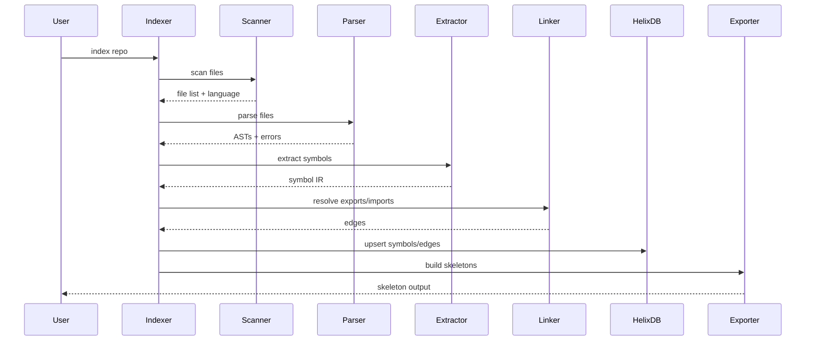
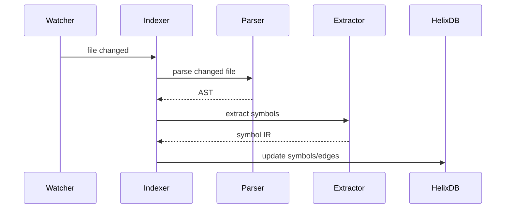

# Design

## Overview

`helix-map` indexes a repository into a compact symbol graph stored in HelixDB
and emits a minimal "skeleton" view suitable for LLM context. The system favors
fast, incremental updates and a language-pluggable extractor model.

## Goals

- Build a stable symbol graph: functions, types, exports, fields, methods
- Provide compact skeleton output with predictable truncation
- Support incremental indexing with file-hash caching
- Keep language support modular and extensible

## Non-Goals

- Full semantic type resolution for every language
- Full call graph accuracy in the presence of dynamic dispatch
- Executing or compiling the target project

## Architecture

Pipeline stages:

1. **Scan**: find source files, classify language, apply ignore rules
2. **Parse**: Tree-Sitter per file with incremental parsing
3. **Extract**: language-specific extractor to normalized symbol IR
4. **Link**: resolve module paths, exports, and local relationships
5. **Store**: upsert symbols and edges in HelixDB
6. **Emit**: produce skeleton views and exports

## Components

- **Scanner**: filesystem traversal and language detection
- **Parser**: Tree-Sitter wrappers, parse caches, error handling
- **Extractor**: per-language query rules -> Symbol IR
- **Linker**: module graph, export resolution, relationship inference
- **Indexer**: orchestrates incremental updates and cache invalidation
- **Storage**: HelixDB schema and upsert/remove operations
- **Exporter**: skeleton format and token-budget truncation

## Data Model (HelixDB)

- `files`
  - `path`, `language`, `hash`, `last_indexed_at`
- `symbols`
  - `id`, `name`, `qual_name`, `kind`, `visibility`, `signature`, `doc`, `file`,
    `span`, `hash`
- `edges`
  - `from_id`, `to_id`, `kind` (exports, imports, implements, extends, calls)
- `skeletons`
  - `scope` (file or module), `text`, `hash`, `token_count`

## Symbol IR

- **Kind**: function, type, trait/interface, method, field, const, module
- **Signature**: minimal, stable, and language-appropriate
- **Visibility**: public, protected, private (mapped per language)

## Skeleton Format

- Per-file or per-module blocks with a deterministic order:
  1. Module path
  2. Exports
  3. Types (with fields)
  4. Functions (with signatures)
- Optional doc summary as a single line comment per symbol
- Truncation rules: drop private symbols first, then fields, then docs

## Indexing Flow

## Incremental Update Flow

## Language Strategy

- Tree-Sitter as the baseline parser for all supported languages
- Optional semantic resolvers per language (e.g., Rust analyzer) for deeper
  edges
- Language plug-ins ship with:
  - Tree-Sitter grammar
  - Query files for symbol extraction
  - Visibility and signature normalization rules

## Error Handling and Observability

- Parse failures are non-fatal and logged with file path and language
- Extraction failures degrade per-file, not per-repo
- Index runs produce a summary report: files indexed, skipped, failed

## Open Questions

- How much semantic resolution is needed for "good enough" skeletons?
- What is the minimal stable signature format across languages?
- How should cross-repo dependencies be represented in HelixDB?
